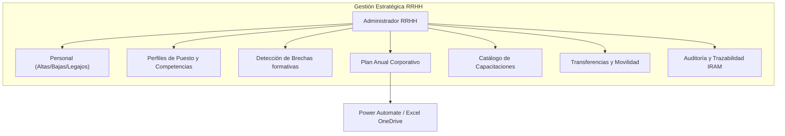
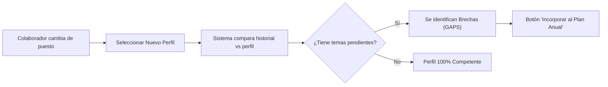

# Manual de Gestión Integral: Rol Administrador de Recursos Humanos (RRHH)
**Sistema de Gestión de Competencia y Formación (SGCySV) - AUBASA**  
*Guía de Administración para la Gerencia de Recursos Humanos y Capacitación*

---

## 1. Visión General y Alcance del Rol

El **Rol Administrador de RRHH** tiene la máxima autoridad funcional sobre la gestión del talento, la formación obligatoria y normativa, los perfiles de puesto y el cumplimiento de las metas del Sistema de Gestión Integrado (ISO 9001 y Seguridad Vial ISO 39001).

### Facultades Exclusivas de RRHH
1. **Control Global:** Visualización consolidada de todas las gerencias y áreas de AUBASA sin restricciones de sector.
2. **Ciclo de Vida del Colaborador:** Altas, bajas, cambios de legajo, reasignación de puestos y seguimiento histórico.
3. **Definición de Competencias:** Creación y mantenimiento de los Perfiles de Puesto y su malla de temas requeridos.
4. **Matriz de Brechas (Gaps):** Detección automática de faltantes formativos ante cambios de puesto o ingresos.
5. **Auditoría y Eficacia:** Aprobación de reprogramaciones, dictamen de eficacia formativa y preparación de evidencias para auditorías IRAM.

---

## 2. Panel de Control Global (Dashboard)

El Dashboard para el Administrador de RRHH consolida la totalidad de la empresa en tiempo real:

### 2.1. Métricas Corporativas
- **Total Acciones Formativas:** Volumen total de capacitaciones programadas en la compañía.
- **Tasa de Cumplimiento Global (% Realizado):** Grado de avance consolidado hacia la meta anual.
- **Capacitaciones en Plan:** Total de actividades pendientes o en calendario.
- **Eficacia Formativa:** Proporción de capacitaciones evaluadas como *Eficaces*, *Ineficaces* o *Pendientes de Evaluación*.

### 2.2. Filtros Multidimensionales
Permiten realizar diagnósticos rápidos en comités de gerencia:
- **Por Sector:** Seleccione cualquier área (ej. *Comercial*, *Peaje*, *Seguridad e Higiene*, *Mantenimiento*).
- **Por Perfil de Puesto:** Para auditar roles críticos de la operación vial.
- **Por Colaborador:** Para revisar el expediente formativo individual.

---

## 3. Módulo "Personal" (Altas, Bajas y Legajos)

Ruta: `/personal`  
Este módulo gestiona la base de colaboradores que alimenta todos los planes de capacitación.

### 3.1. Dar de Alta a un Nuevo Colaborador
1. En la parte superior, presione el botón **"+ Nuevo Colaborador"**.
2. Complete el formulario con los siguientes campos obligatorios:
   - **Nombre y Apellido:** Formato formal (ej. `González, Martín`).
   - **Legajo:** Número formal de 5 dígitos (ej. `12850`).
   - **Sector / Gerencia:** Seleccione el área a la que pertenece el puesto.
   - **Perfil de Puesto Inicial:** Asigne el perfil correspondiente (ej. *Operador Contact Center*, *Cajero Peaje*, *Supervisor*).
3. Presione **"Guardar"**.

> [!TIP]
> **Asignación Automática:** Al vincular al colaborador con un Perfil de Puesto, el sistema detecta de inmediato los temas normativos y obligatorios que debe cursar ese colaborador según su función.

### 3.2. Bajas y Desactivación de Personal
Cuando un colaborador finaliza su vínculo con la empresa:
1. Localice al colaborador mediante el buscador de legajo o nombre.
2. Presione el botón **"Dar de Baja"** (o ícono de desactivación).
3. El colaborador quedará marcado como inactivo (`isActive = false`). Sus registros históricos y certificados pasados se conservan intactos por trazabilidad legal, pero ya no aparecerá en las planificaciones futuras.

---

## 4. Módulo "Perfiles de Puesto"

Ruta: `/perfiles`  
El perfil de puesto define el estándar de competencia requerido para cada posición de la organización.

### 4.1. Crear o Modificar un Perfil
1. Ingrese a la pestaña **Perfiles de Puesto**.
2. Para crear uno nuevo, presione **"+ Nuevo Perfil"**; para editar, seleccione el perfil en la lista.
3. Defina el **Título del Perfil** y el **Área/Sector**.
4. **Malla de Capacitaciones Requeridas:**
   - Seleccione de la lista qué temas debe aprobar obligatoriamente quien ocupe este cargo (ej. *Manejo manual de cargas*, *Política del SGI*, *Atención al Usuario*, *Reglamento de Explotación*).
   - Indique si la capacitación es de carácter *Obligatoria* o *Deseable/Complementaria*.
5. Presione **"Guardar Perfil"**.

---

## 5. Módulo "Cambio de Puesto" (Análisis de Brechas)

Ruta: `/brechas`  
Esta herramienta automatiza el proceso requerido por el Procedimiento de Competencia y Formación (PAU/05).

### 5.1. Procedimiento de Cambio de Puesto
1. Seleccione al colaborador en el desplegable.
2. Seleccione el **Nuevo Perfil de Puesto** al que será promovido o trasladado.
3. El sistema realiza una comparación instantánea entre:
   - Los cursos que el colaborador ya completó en su trayectoria.
   - Las competencias exigidas por el nuevo perfil.
4. Los temas faltantes se resaltan en rojo como **"Brecha Identificada"**.
5. Con un solo clic en **"Generar Plan de Nivelación"**, estas necesidades se transforman automáticamente en registros del **Plan Anual** para que el sector programe sus fechas de dictado.

---

## 6. Módulo "Plan Anual" Corporativo

Ruta: `/plan-anual`  
Supervisión y control centralizado de todas las actividades formativas de la empresa.

### 6.1. Acciones del Administrador de RRHH
- **Filtro Integral por Año:** Puede alternar entre los planes 2025, 2026 o años posteriores.
- **Asignación Ad-Hoc Masiva:**
  - Puede asignar un tema formativo nuevo a todo un perfil completo (ej. *"Actualización Procedimiento de Peaje 2026"* para todos los *Operadores de Cobro*) o a colaboradores específicos.
- **Reprogramaciones:**
  - Puede revisar las fechas reprogramadas por los sectores y validar que cuenten con la debida justificación.
- **Evaluación de Eficacia:**
  - Tras 30, 60 o 90 días de dictada una capacitación, RRHH o la Jefatura deben evaluar si la capacitación logró su impacto en el puesto.
  - Seleccione: `Eficaz`, `Ineficaz` (requiere plan de refuerzo) o `Pendiente`.

### 6.2. Sincronización Automática con OneDrive (Power Automate)
Cada vez que un sector o RRHH modifica un registro (fecha realizada, calificación, reprogramación o nueva asignación):
- El sistema dispara un webhook directo a **Power Automate**.
- La planilla oficial de Excel almacenada en el **OneDrive corporativo** se actualiza automáticamente.
- **No es necesario realizar cargas manuales paralelas en Excel.**

---

## 7. Módulo "Temas a Capacitar" (Catálogo Maestro)

Ruta: `/capacitaciones`  
Base de conocimientos donde se administran todos los programas y cursos de AUBASA.

- **Alta de Nuevos Cursos:** Registro de nuevas temáticas requeridas por normativas legales (Ley 24449, SRT, Medio Ambiente) o normas de calidad (ISO 9001/39001).
- **Categorización:** Clasificación de temas en:
  - *Institucionales / SGI* (ej. Política del SGI, Manejo de Residuos).
  - *Seguridad e Higiene* (ej. Ergonomía, Riesgo Eléctrico, Prevención de Incendios, Primeros Auxilios).
  - *Específicas del Puesto* (ej. Procedimientos PAU, Facturación, Atención al Usuario).

---

## 8. Módulo "Transferencias"

Ruta: `/transferencias`  
Control y autorización formal de la movilidad interna de colaboradores entre sectores:
1. Visualización de transferencias solicitadas por los sectores.
2. **Aprobación de RRHH:** Al aprobar la solicitud, el colaborador pasa a formar parte de la nueva dotación del sector destino.
3. El sistema actualiza automáticamente los filtros de sector del colaborador y alerta si requiere inducción o nivelación en su nueva área.

---

## 9. Módulo "Auditoría e Historial"

Ruta: `/auditoria`  
Herramienta clave para auditorías internas del SGI y auditorías externas del Instituto IRAM.
- Muestra el registro inalterable de evaluaciones de inducción, fechas de examen, instructores intervinientes y evidencias fotográficas/documentales adjuntas.
- Permite responder requerimientos de auditoría en segundos sin necesidad de buscar carpetas de papel físicas.

---

## 10. Gestión de Usuarios y Accesos (`/accesos`)

En coordinación con el área de SGI, los accesos se estructuran en 3 roles:

| Rol en el Sistema | Alcance | Cuándo Asignarlo |
| :--- | :--- | :--- |
| **`RRHH`** | Control total funcional, personal, brechas, perfiles y planes corporativos. | Equipo de Gestión de Personas y Capacitación. |
| **`SGI`** | Administración integral del sistema, configuración y accesos. | Responsables del Sistema de Gestión Integrado. |
| **`SECTOR`** | Visualización y gestión restringida exclusivamente a su área operativa. | Jefes de Sector, Supervisores, Referentes de Base. |

### Resolución de Incidencias Frecuentes
- **Error `email rate limit exceeded`:**
  - Ocurre cuando se envían más de 3 correos de invitación o recuperación en una hora debido a límites de seguridad del servicio base de correo.
  - **Acción inmediata:** Se asigna una contraseña provisoria directa al usuario en la base de datos (ej. `Aubasa2026!`) para que ingrese de inmediato sin necesidad de esperar el correo.
