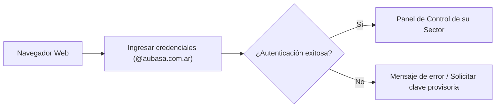
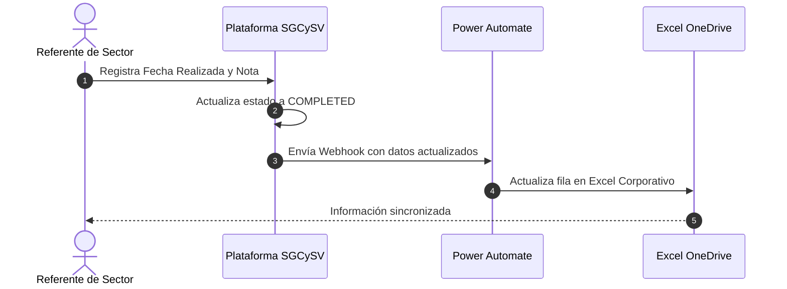

# Manual de Uso del Sistema: Rol Sectores
**Sistema de Gestión de Competencia y Formación (SGCySV) - AUBASA**  
*Guía operativa para Referentes de Área, Supervisores y Jefaturas de Sector*

---

## 1. Introducción y Alcance del Rol

El **Rol Sector** está diseñado para que los responsables, supervisores y referentes de cada gerencia o área operativa gestionen de manera ágil el plan de formación de su propio equipo, con acceso focalizado y seguro.

### ¿Qué puede hacer el Rol Sector?
- Consultar el **Panel de Control (Dashboard)** con los indicadores exclusivos de su sector.
- Consultar la **dotación activa** de colaboradores asignados a su área y sus perfiles de puesto.
- Gestionar el **Plan Anual de Capacitación** de su sector:
  - Visualizar capacitaciones programadas, pendientes y realizadas.
  - Registrar la ejecución de capacitaciones (fecha real, calificación obtenida, adjuntos de certificados).
  - Reprogramar capacitaciones con justificación en caso de fuerza mayor.
  - Gestionar la **firma digital** del colaborador y del instructor.
- **Sincronización automática:** Cada capacitación cargada o firmada impacta en tiempo real en la planilla central de OneDrive de la empresa mediante el flujo automático de Power Automate.
- Solicitar y gestionar **Transferencias de Personal** hacia o desde su sector.

### Restricciones de Seguridad del Rol
> [!NOTE]
> Por políticas de privacidad y control interno del SGI (ISO 9001 / ISO 39001), los usuarios de Sector:
> - **Solo visualizan personal y registros de su sector asignado.** No tienen acceso a los datos de otros sectores.
> - **No tienen acceso al módulo de Brechas globales**, administración de cuentas de usuario ni configuración general del sistema.

---

## 2. Acceso a la Plataforma e Inicio de Sesión

### 2.1. Ingreso al Sistema
1. Abra su navegador web (Google Chrome, Microsoft Edge o Mozilla Firefox) e ingrese a:
   **[https://formacion-y-competencia.vercel.app/](https://formacion-y-competencia.vercel.app/)**
2. Ingrese su **Correo Electrónico Corporativo** (`usuario@aubasa.com.ar`).
3. Ingrese su **Contraseña**.
4. Presione el botón **"Ingresar"**.

> [!TIP]
> **Tiempo de Inactividad:** Por razones de seguridad informática, la sesión se cerrará automáticamente tras **2 horas de inactividad**.

### 2.2. Olvido de Contraseña o Error de Envío
Si al intentar restablecer su clave observa el mensaje `email rate limit exceeded`, esto se debe a un límite transitorio de seguridad en el envío de correos automáticos.  
**Solución:** Contacte al Administrador del Sistema (SGI / RRHH) para que le configure una contraseña temporal directa con la que podrá acceder sin demoras.

---

## 3. Navegación Principal

Al ingresar, visualizará la barra lateral izquierda con los módulos habilitados para su sector:

| Ícono | Módulo | Función Principal |
| :---: | :--- | :--- |
| 📊 | **Dashboard** | Métricas gráficas, porcentaje de avance anual y estado del sector. |
| 👤 | **Personal (Legajos)** | Listado del personal a su cargo, legajo, perfil asignado y estado. |
| 💼 | **Perfiles de Puesto** | Consulta de requisitos y temas de capacitación definidos para cada perfil. |
| 📅 | **Plan Anual** | Calendario de capacitaciones, carga de resultados, actas y firmas. |
| ⇄ | **Transferencias** | Solicitudes de pase de colaboradores entre sectores. |

---

## 4. Módulo "Dashboard" (Panel de Control)

El Dashboard le brinda una visión ejecutiva inmediata del estado de formación de su equipo.

### Indicadores Clave:
- **Total de Acciones Formativas:** Volumen total planificado para el período.
- **Capacitaciones Realizadas (% Avance):** Porcentaje de cumplimiento del plan anual.
- **Capacitaciones en Plan:** Acciones que están pendientes o calendarizadas para los próximos meses.
- **Eficacia de la Capacitación:** Estado de las evaluaciones de efectividad post-capacitación.

### Filtros Disponibles:
Puede segmentar la información utilizando los selectores superiores:
- **Por Perfil de Puesto:** Para analizar el estado de un grupo funcional específico (ej. *Operadores de Contact Center*).
- **Por Colaborador:** Para revisar la situación particular de una persona.

---

## 5. Módulo "Plan Anual": Gestión Operativa

Este es el módulo central de su labor diaria. Aquí se visualizan y gestionan todas las actividades de capacitación del sector.

### 5.1. Filtros y Búsqueda
En la parte superior dispone de filtros para localizar rápidamente una capacitación:
- **Buscador de texto:** Permite escribir el nombre del tema (ej. *"SGI"*, *"Cargas"*, *"WhatsApp"*).
- **Filtro por Estado:**
  - `Capacitaciones en Plan` (programadas a futuro o pendientes).
  - `Capacitaciones Realizadas` (con fecha de ejecución y nota).
  - `Brechas / Pendientes`.
- **Filtro por Colaborador o Puesto.**

---

### 5.2. Cómo Cargar una Capacitación Realizada

Cuando un colaborador de su sector completa una capacitación programada, siga estos pasos:

1. Ubique la fila correspondiente al colaborador y al tema en la tabla del **Plan Anual**.
2. En la columna de acciones (a la derecha), presione el botón **"Completar"** (o ícono de edición).
3. Se abrirá una ventana emergente donde debe completar:
   - **Fecha Real de Realización:** Día exacto en que se impartió la clase o examen.
   - **Calificación / Nota:** Puntaje obtenido (ej. `10`, `9`, `Aprobado`).
   - **Archivo de Constancia / Certificado (Opcional):** Puede adjuntar el PDF o foto del examen/certificado.
4. Presione **"Guardar Capacitación"**.

> [!IMPORTANT]
> Al presionar guardar, el sistema realiza dos acciones automáticas:
> 1. Actualiza el estado a `COMPLETED` en la base de datos de la plataforma.
> 2. **Envía los datos a Power Automate:** En pocos segundos se actualiza la planilla Excel en OneDrive con la fecha, la nota y el estado "Capacitación Realizada".

---

### 5.3. Cómo Reprogramar una Capacitación

Si por razones operativas, licencia médica o cobertura de servicio una capacitación no puede dictarse en la fecha original:

1. Ubique la capacitación en la tabla.
2. Haga clic en **"Reprogramar"**.
3. Seleccione la **Nueva Fecha Propuesta**.
4. Ingrese una breve **Justificación** del motivo del cambio (requerimiento de auditoría).
5. Presione **"Confirmar Reprogramación"**.

---

### 5.4. Proceso de Firma Digital

Para dar cumplimiento formal a las normas ISO y los requisitos de Recursos Humanos, las capacitaciones cuentan con un circuito de firma digital sin necesidad de imprimir papel:

1. Al abrir el detalle de una capacitación completada, verá la opción de **"Generar enlace de firma"** o el botón de firma en pantalla.
2. El colaborador o instructor puede firmar dibujando su rúbrica en la pantalla táctil o con el mouse.
3. El sistema guarda la firma digital con fecha y hora exacta, garantizando la trazabilidad.

---

## 6. Módulo "Personal" y "Transferencias"

### 6.1. Consulta de Personal
En la sección **Personal (Legajos)** puede verificar:
- Lista completa de los empleados de su sector.
- Número de legajo formal.
- Perfil de puesto asignado.
- Historial formativo individual haciendo clic sobre el nombre del colaborador.

### 6.2. Transferencias de Personal
Si un colaborador es transferido a otra gerencia o si su sector recibe a un nuevo integrante:
1. Ingrese a la pestaña **"Transferencias"**.
2. Presione **"Solicitar Transferencia"**.
3. Seleccione al colaborador y el sector de destino.
4. Una vez aprobada por Recursos Humanos, el personal y su plan formativo se vincularán al nuevo sector sin perder su historial histórico.

---

## 7. Preguntas Frecuentes y Soporte

**¿Por qué no veo a un colaborador nuevo de mi sector en la lista?**  
Los colaboradores nuevos deben ser dados de alta previamente por Recursos Humanos con su perfil de puesto asignado. Si falta alguien, comuníquese con RRHH para su alta en el sistema.

**¿Qué hago si cargué mal una nota o una fecha?**  
Puede volver a ingresar a la fila del colaborador en el *Plan Anual*, hacer clic en editar y corregir la información. La corrección se sincronizará nuevamente.

**¿Puedo exportar los datos de mi sector?**  
Sí, en las vistas principales dispone de botones para descargar informes en formato PDF y hojas de cálculo para reuniones internas de gerencia.
